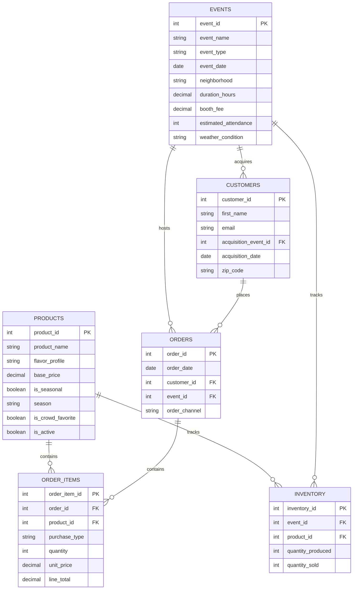

# Retail Demand Forecasting & Inventory Optimization

## Overview

This project builds a demand forecasting and inventory optimization
system for a cookie pop-up business — identifying which flavors,
events, and customer segments drive profitability, and generating
production recommendations to minimize waste and maximize revenue
per event.

The analysis covers 12 months of simulated sales, inventory, and
event performance data across six normalized tables, producing
actionable recommendations a business operator could act on
immediately.

---

## Business Problem

Small pop-up food businesses operate with limited capital and no
margin for waste. Every event requires production decisions made days
in advance with imperfect information:

- How much of each cookie flavor should be produced per event?
- Which events generate the best return after accounting for booth fees?
- Which flavors drive the most revenue and have the strongest repeat demand?
- Which purchase formats — individual, 3-pack, or 6-pack — drive the
  highest average order value?
- How does online order volume compare to in-person event revenue?

Poor answers to these questions result in wasted inventory, missed
revenue, and unprofitable events. This project builds the analytical
foundation to answer them systematically.

---

## Dataset

**Source:** Data modeled after real pop-up operations in San Diego. Distributions, pricing, event types,
and seasonal patterns are informed by real operational experience
running a San Diego-based cookie pop-up business.

**Scale:**
- 38 events across 12 months (2024 calendar year)
- 1,999 orders
- 5,372 order line items
- 6 normalized tables

**Tables:**

| Table | Description | Rows (actual) |
|---|---|---|
| `products` | Cookie catalog with flavor profiles and seasonal flags | 12 |
| `customers` | Customer records with acquisition context | 1,000 |
| `events` | Pop-up events with cost and operational data | 38 |
| `orders` | One record per customer transaction | 1,999 |
| `order_items` | One record per cookie flavor per order | 5,372 |
| `inventory` | Production vs. sales by flavor by event | 407 |

---

## Product Catalog

12 cookie flavors across 3 flavor profiles. All cookies priced at $5.00
individually, $13.00 for a 3-pack, or $24.00 for a 6-pack.

| Flavor | Profile | Notes |
|---|---|---|
| Matcha White Chocolate | Tea-Based | |
| Hojicha White Chocolate | Tea-Based | |
| Strawberry Milk Tea | Tea-Based | Crowd favorite |
| Thai Tea | Tea-Based | |
| Vietnamese Coffee | Nutty & Roasted | |
| Black Sesame Dark Chocolate | Nutty & Roasted | |
| Honey Sesame | Nutty & Roasted | Crowd favorite |
| Pandan Coconut | Sweet & Nostalgic | Crowd favorite |
| Classic Chocolate Chip | Sweet & Nostalgic | |
| Bolo Bao | Sweet & Nostalgic | Seasonal: Spring/Summer |
| Sweet Corn | Sweet & Nostalgic | Seasonal: Fall/Winter |
| Vietnamese Fried Banana | Sweet & Nostalgic | |

---

## Data Model

**Key relationships:**
- One event contains many orders
- One order contains many order items
- Each order item references one cookie flavor and one purchase type
- Inventory tracks production and sales per flavor per event
- Online orders are tied to a dummy Online Pickup event — excluded
  from inventory waste calculations since online orders are made to order
- Customers are acquired at a specific event

---

## SQL Techniques Demonstrated

| Technique | Where Used | Status |
|---|---|---|
| Multi-table JOINs | 01, 02 | Demonstrated |
| CTEs | 01, 02 | Demonstrated |
| Window functions (LAG, DENSE_RANK) | 01 | Demonstrated |
| CASE WHEN | 01, 02 | Demonstrated |
| Aggregations and GROUP BY | 01, 02 | Demonstrated |
| Date functions | 01 | Demonstrated |
| Derived metrics (waste rate, sell-through %) | 01, 02 | Demonstrated |
| Rolling averages, RANK, LAG | 05 (forecasting) | Demonstrated |
| Self-joins | 04 (product mix) | Demonstrated |
| Revenue-per-hour, booth-fee-adjusted profit | 03 (event performance) | Demonstrated |

---

## Analysis Sections

**01 — Demand Analysis**
Which flavors drive revenue and volume? Which have seasonal patterns?
Month-over-month revenue trends by flavor profile.

**02 — Inventory Optimization**
Where is waste occurring by flavor and event type? What production
levels maximize sell-through? Which flavors consistently over or
underperform production estimates?

**03 — Event Performance**
Which events generate the best return after booth fees and duration?
Which neighborhoods perform best? Revenue per hour by event type.

**04 — Product Mix**
Which flavors are purchased together most often? Which purchase format
— individual, 3-pack, or 6-pack — drives the highest average order
value? How does online revenue compare to in-person event revenue?

**05 — Forecasting**
Simple moving average demand forecasts and production recommendations
by flavor for upcoming events.

---

## How to Run

1. Run `sql/schema.sql` to create the database and all tables
2. Run the Python data generation script to populate `data/`
3. Load CSVs using `sql/load_data.sql`
4. Execute analysis files in numbered order

**Requirements:** MySQL 9.7+, Python 3.x, TablePlus (optional GUI)

---

## Tools

- MySQL 9.7
- Python (synthetic data generation)
- TablePlus

---

## About the Data

This project uses synthetic data rather than a downloaded dataset.
Generating synthetic data allowed precise control over schema design,
realistic business distributions, and the ability to demonstrate
specific SQL patterns without being constrained by a third-party
dataset's structure.

Pricing, event types, neighborhoods, seasonal patterns, and flavor
demand distributions are modeled after real operational experience.
All customer names and emails are entirely fictional.
